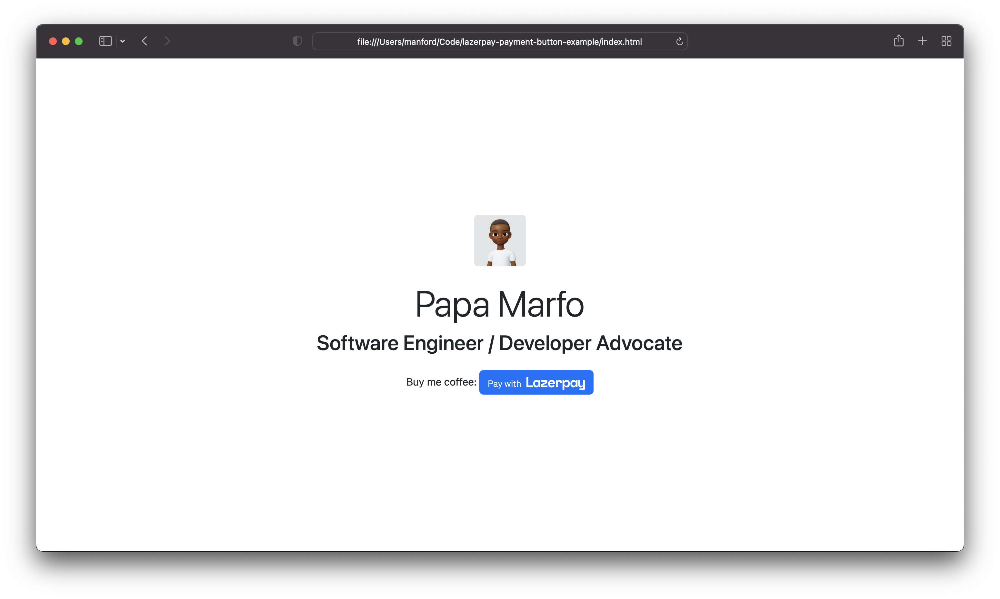

# Lazerpay Payment Request Button Demo

Accept payments from customers with crypto with a button. The Payment Request Button gives you a single integration for Lazerpay.

<p align="center">
    
</p>

## Prerequisites

Before we start, learn how to create a button here: [https://blog.lazerpay.finance/how-to-add-lazerpay-payment-button-to-your-website](https://blog.lazerpay.finance/how-to-add-lazerpay-payment-button-to-your-website)

## Setup

Replace the script tag in the html file with your new Lazerpay payment request button script from the dashboard.

```bash
<script src="https://js.lazerpay.finance/v1/index.min.js"></script>
<script>
    document.querySelector(".paynow").addEventListener("click", () => {
        LazerCheckout({
            email: "papamarfo@gmail.com",
            name: "Papa Marfo",
            amount: "1.00",
            currency: "USD",
            logo: "img/headshot.jpeg",
            key: "pk_test_dMXWvLAyS7ukOEBj30S1XWXGxQX4DZ0MeK5YaVCJDJZBhnb2Jj}",
            paymentButtonId: "bec81d02-94b0-4ad9-b3e9-0d30f898f0ab"
        });
    });
</script>
```

## Run locally

```bash
# clone the repo
https://github.com/papamarfo/lazerpay-payment-request-button-demo.git

# change directory
cd lazerpay-payment-request-button-demo
```

Since these are all static assets you can serve them locally with a simple web server, e.g.

PHP

```bash
php -S localhost:8000
```

Python 2

```bash
python -m SimpleHTTPServer 8000
```

Python 3

```bash
python -m http.server 8000
```